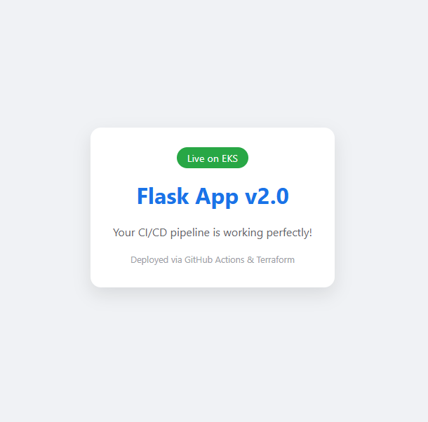
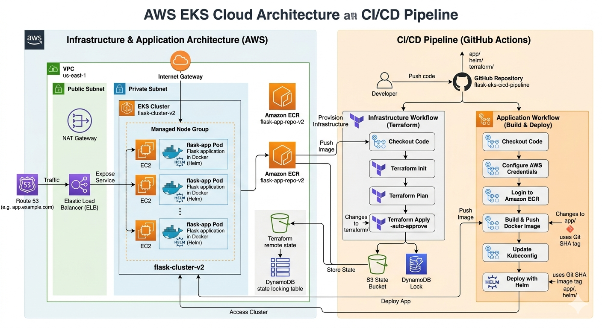

# AWS EKS Cloud Architecture & CI/CD Pipeline (v2.0)



## Project Overview
This repository implements a complete lifecycle of a web application, from Infrastructure as Code to a fully automated CI/CD pipeline deploying to a production-ready AWS EKS cluster.

## Architecture & Workflow

- **Infrastructure:** Provisioned via **Terraform** (VPC, Subnets, EKS, ECR).
- **CI/CD:** Automated via **GitHub Actions** for both Infrastructure and Application.
- **Orchestration:** **Kubernetes (EKS)** managed by **Helm**.

## Tech Stack
| Category | Tools |
| :--- | :--- |
| **Cloud** | AWS (EKS, ECR, VPC, S3, DynamoDB) |
| **IaC** | Terraform |
| **Containers** | Docker, Helm 3 |
| **CI/CD** | GitHub Actions |

---

## How to Run

### 1. Infrastructure Setup
```bash
cd terraform
terraform init
terraform apply -auto-approve
```bash

### 2. Connect to Cluster
```bash
aws eks update-kubeconfig --name flask-cluster-v2 --region us-east-1
```bash

### 3. CI/CD Flow
Every push to main triggers:
Docker Build: Creates a secure, non-root image.
ECR Push: Stores the image in Amazon ECR.
Helm Deploy: Deploys to EKS with rolling updates.

### Best Practices Implemented
- **Security:** Images run as non-root users for runtime security.
- **State Management & Locking:** The project uses **S3 with DynamoDB locking** for Terraform state, ensuring that even during a `destroy` operation, the state remains consistent and protected.
- **Scalability:** Managed Node Groups for high availability.
- **Resource Management:** Kubernetes CPU/Memory limits to prevent OOM.

## Cleanup
To avoid unnecessary AWS costs, the infrastructure can be fully decommissioned using the automated destroy workflow:
1. **Uninstall Helm Release:** Removes the Load Balancer and application resources.
   ```bash
   helm uninstall flask-app
   ```bash

2. **Terraform Destroy:** Run the Terraform Destroy workflow via GitHub Actions (manual trigger) to tear down the EKS cluster, VPC, and ECR repository.